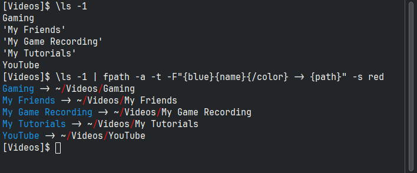
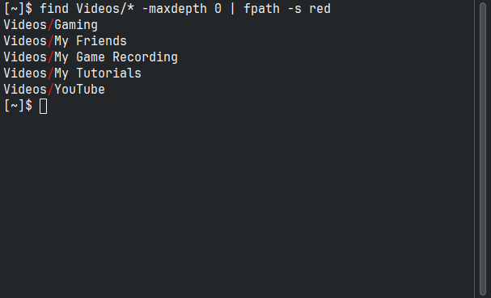
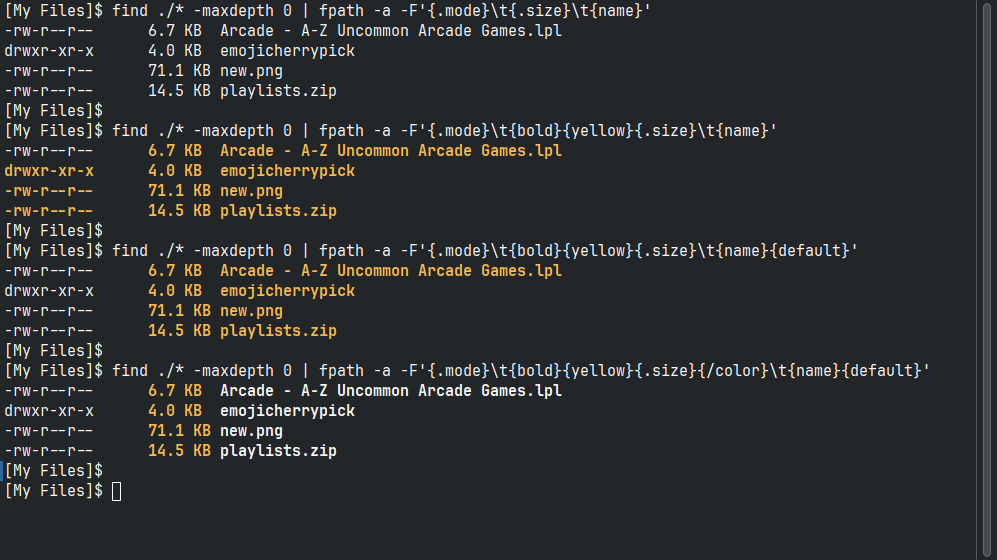

# fpath

Reformat and stylize file path like text output.

- Author: Tuncay D.
- Source: [Github](https://github.com/thingsiplay/fpath)
- License: [MIT License](LICENSE)



## What is this?

Convenience script to style and reformat the output with path like formats.
Designed to combine listings from other programs output, such as from `find`
and even `ls`, or any other tool with similar capabilities. The script works
mostly on text data rather than the file system, but some special commands
are exception to this rule and will access the file system.

### But why?

Seems like a good and legit question. I'm a person who does a lot of things in
the terminal and scripts. Often I will just output all indexed files from
`balooctl6` command or search for files with very specific settings with `find`
command. Often it is hard to read what I am seeing on the screen, especially
with many files. Simply adding some coloring or format and filter output to
make it better readable is a useful thing to do, even if its only temporarily.
This script `fpath` was born, in a matter to simplify and speedup this process
when needed.

BTW, with recent optimizations it's already quite fast, even with thousands
of files/paths as input.

## Installation

This is a Python script. It is developed for Linux and has no external library
dependencies from Python. Certain commands make use of the standard Linux
program `file` in a sub shell process. Just download and give it the executable
bit.

```bash
git clone https://github.com/thingsiplay/fpath
cd fpath
chmod +x fpath
```

### Copy / Install

Following install operation is optional and is just an example how you could
copy the script to your system. Use a destination that makes sense for your
system (i.e. a directory where executable files are located).

```bash
\install -v fpath ~/.local/bin/
```

Note: The backslash at the beginning of `\install` tells Bash to ignore Bash
alias or functions and use the program directly.

## Usage

The usage is pretty simple:

```bash
path... | fpath [options] -- [path...]
```

### Help

List all supported options with `-h` or `--help` option:

```bash
fpath --help
```

List all supported style and format sub commands with `-H` or `--explain`:

```bash
fpath --explain fmt
fpath --explain style
```

### Basics

By default stdin from a piped process is parsed as list of paths split by
newline. Optionally paths can be given as arguments too. All input paths are
output to stdout. Single and double quotes surrounding a path is automatically
detected and removed. Leading tilde character is translated into the users home
directory. With options all of these default processing can be changed.

The stdin can be ignored with option `-z`. And `--` tells the script to stop
processing options and accept anything that comes after the double dash as
input file paths, rather than options. Let's see how all of this works with a
series of simple examples.

Output from `ls` will include quotes for paths with spaces:

```bash
$ cd ~
$ ls -1 Videos
Gaming
'My Friends'
'My Game Recording'
'My Tutorials'
YouTube
```

Pipe that into `fpath`, which removes those quotes automatically for
consistency:

```bash
$ cd ~
$ ls -1 Videos | fpath
Gaming
My Friends
My Game Recording
My Tutorials
YouTube
```

Enforce single quotes on all paths with `-q`:

```bash
$ cd ~
$ ls -1 Videos | fpath -q
'Gaming'
'My Friends'
'My Game Recording'
'My Tutorials'
'YouTube'
```

Because we are not in the same directory as "~/Videos", using the name of a
file or directory would not work. To build a correct path we can tell `fpath`
to add a base path in front of each relative path:

```bash
$ cd ~
$ ls -1 Videos | fpath -b Videos
Videos/Gaming
Videos/My Friends
Videos/My Game Recording
Videos/My Tutorials
Videos/YouTube
```

Add `-a` to turn every relative path into an absolute path, by adding the
current working directory. This operation is safe, as we build a correct
partial path in the previous example. Now we can expand it fully:

```bash
$ cd ~
$ ls -1 Videos | fpath -a -b Videos
/home/tuncay/Videos/Gaming
/home/tuncay/Videos/My Friends
/home/tuncay/Videos/My Game Recording
/home/tuncay/Videos/My Tutorials
/home/tuncay/Videos/YouTube
```

`find` is a better tool for scripting and combining output with other tools.

```bash
$ cd ~
$ find Videos/* -maxdepth 0
Videos/Gaming
Videos/My Friends
Videos/My Game Recording
Videos/My Tutorials
Videos/YouTube
```

Let's play with the path separator slash "/" and replace it by option `-/` to
any other text:

```bash
$ cd ~
$ find Videos/* -maxdepth 0 | fpath -/' -> '
Videos -> Gaming
Videos -> My Friends
Videos -> My Game Recording
Videos -> My Tutorials
Videos -> YouTube
```

Color of the path separator (meaning "/" by default) can changed with the style
option `-s` . For simplicity only one style can be specified here, but curved
brackets `{` and `}` are not required.

```bash
$ cd ~
$ find Videos/* -maxdepth 0 | fpath -s red
# see img/red.png
```



Have in mind that styles from `-s` will partially overwrite and collide with
styles specified in `-F` option, if not being carefully.

### Advanced

Using the `-F` option you get to control what and how it is being output.
Control sequences and variables allow fine grained formatting. These commands
need to be enclosed by curved brackets `{` and `}`, such as `{red}` or
`{dirname}` to be recognized. Mix and match them together with arbitrary text
to form the exact format you like.

For the following examples, I have create a new directory with random files:

```bash
$ cd ~/Desktop/My" "Files/
$ find ./* -maxdepth 0
./Arcade - A-Z Uncommon Arcade Games.lpl
./emojicherrypick
./new.png
./playlists.zip
```

Let's turn the tables and get to the meat. Show base name of file, with it's
directory part below, indicated by an arrow:

```bash
$ cd ~/Desktop/My" "Files/
$ find ./* -maxdepth 0 | fpath -a -F'{name}\n\t-> {dir}\n'
Arcade - A-Z Uncommon Arcade Games.lpl
        -> /home/tuncay/Desktop/My Files

emojicherrypick
        -> /home/tuncay/Desktop/My Files

new.png
        -> /home/tuncay/Desktop/My Files

playlists.zip
        -> /home/tuncay/Desktop/My Files

```

Display any custom text conditionally, if its a directory `{.isdir:text}`, a
regular file `{.isreg:text}` or a symbolic link `{.islink:text}`. The `text`
portion is only written, if the condition is met.

```bash
$ cd ~/Desktop/My" "Files/
$ find ./* -maxdepth 0 | fpath -a -F'{name}\n\t-> {.isdir:directory}\n'
Arcade - A-Z Uncommon Arcade Games.lpl
        ->

emojicherrypick
        -> directory

new.png
        ->

playlists.zip
        ->

```

We can even nest other variables inside the `text` (however this is not
extensively tested yet, so you should be careful):

```bash
$ cd ~/Desktop/My" "Files/
$ find ./* -maxdepth 0 | fpath -a -F'{name}\n\t-> {.isdir:"{path}/"}\n'
Arcade - A-Z Uncommon Arcade Games.lpl
        ->

emojicherrypick
        -> "/home/tuncay/Desktop/My Files/emojicherrypick/"

new.png
        ->

playlists.zip
        ->

```

Let's add some more information to the output, such as the file permissions and
file size (but with double colon and without arrow this time):

```bash
$ cd ~/Desktop/My" "Files/
$ find ./* -maxdepth 0 | fpath -a -F'{name}:\n\t{dir}\n\t{.mode}\n\t{.size}\n'
Arcade - A-Z Uncommon Arcade Games.lpl:
        /home/tuncay/Desktop/My Files
        -rw-r--r--
        6.7 KB

emojicherrypick:
        /home/tuncay/Desktop/My Files
        drwxr-xr-x
        4.0 KB

new.png:
        /home/tuncay/Desktop/My Files
        -rw-r--r--
        71.1 KB

playlists.zip:
        /home/tuncay/Desktop/My Files
        -rw-r--r--
        14.5 KB

```

Wanna have a format that is more familiar? Here we have added the mime type
with {mime} as well, which works by looking into file content with standard
Linux program `file`. It's called only once for all paths together, therefore
this will not slowdown the script with many paths, even thousands.

```bash
$ cd ~/Desktop/My" "Files/
$ find ./* -maxdepth 0 | fpath -a -F'{.mode}\t{.size}\t{mime}     \t{name}'
-rw-r--r--      6.7 KB  us-ascii        Arcade - A-Z Uncommon Arcade Games.lpl
drwxr-xr-x      4.0 KB  binary          emojicherrypick
-rw-r--r--      71.1 KB binary          new.png
-rw-r--r--      14.5 KB binary          playlists.zip
```

In `-F` option we can also use the various color and effects commands, such as
`{yellow}` in example. Unlike in option `-s`, we have to put them in curly
braces. But it is important to understand that we have to reset the color or
entire style for the line, otherwise it will spill over to next line. Look at
the screenshot for the output, to understand the differences:

Note: An empty `{}` is a shortcut for `{default}`.

```bash
$ cd ~/Desktop/My" "Files/
$ find ./* -maxdepth 0 | fpath -a -F'{.mode}\t{.size}\t{name}'
$ find ./* -maxdepth 0 | fpath -a -F'{.mode}\t{bold}{yellow}{.size}\t{name}'
$ find ./* -maxdepth 0 | fpath -a -F'{.mode}\t{bold}{yellow}{.size}\t{name}{default}'
$ find ./* -maxdepth 0 | fpath -a -F'{.mode}\t{bold}{yellow}{.size}{/color}\t{name}{}'
# see img/bold_yellow.png
```



Time and date can be displayed with `{.atime}` for last access, `{.mtime}` for
last modification and `{.ctime}` for last change in a human readable format.

```bash
$ cd ~/Desktop/My" "Files/
$ find ./* -maxdepth 0 | fpath -a -F'{.mtime}  \t{name}'
Sunday, October 23, 2022 02:07:30       Arcade - A-Z Uncommon Arcade Games.lpl
Wednesday, April 13, 2022 06:18:43      emojicherrypick
Wednesday, April 10, 2024 07:13:06      new.png
Saturday, May 04, 2024 04:40:03         playlists.zip
```

Time commands have a special variant allowing for custom formatting. Their
options are separated by double color, like this `{.mtime:options}`. The
options are actually format codes interpreted by
[strftime](https://docs.python.org/3/library/datetime.html#strftime-and-strptime-format-codes):

```bash
$ cd ~/Desktop/My" "Files/
$ find ./* -maxdepth 0 | fpath -a -F'{.mtime:%Y/%m/%d}\t{name}'
2022/10/23      Arcade - A-Z Uncommon Arcade Games.lpl
2022/04/13      emojicherrypick
2024/04/10      new.png
2024/05/04      playlists.zip
```

There are so many more commands and functionality. Such as slices in form of
`{start:end}` even supporting negative numbers, to get any part of the path,
such as `{-1:}` to access file name or `{3:5}` to get fourth and fifth element.
No, this is not at typo. Counting starts by 0 and the end index is where to
stop, without including it. Just test and play around with it to understand.

I hope this helps in understanding what this tool can do and if it is for you.

### Control sequences overview

Here is a quick listing of the supported control sequences with curly braces
such as `{red}` usable in `-F`. Display an explanation and list all supported
commands with `-explain` option:

```bash
fpath --explain fmt
fpath --explain fmt_compact
fpath --explain style
fpath --explain style_compact
```

```
"\\": literal single slash "\"
"\{": literal "{"
"\}": literal "}"
"\n": newline
"\t": tab
"\r": carriage return
"\b": backspace
"\f": form feed

{q}: literal single quote '
{qq}: literal double quote "
{STYLE}: name of the style like 'green' or 'bold'
{center:num}: center text by padding with NUM * space
{ljust:num}: left justify text by padding with NUM * space
{rjust:num}: right justify text by padding with NUM * space
{fill:num}: left fill with '0', leading +- sign is preserved
{/center}: end marker for center
{/ljust}: end marker for ljust
{/rjust}: end marker for rjust
{/fill}: end marker for fill
{origin}: original input data before processing
{list}: path broken up into individual parts
{0}..{9}: direct access each part with index, from {0} to {9}
{-start:end}: slice from any to any index, including negative numbers
{index}: current number of path in process
{i}: same as {index}
{total}: total count of paths to process
{path}: path as posix
{root}: drive and root if any
{uri}: path as file URI
{dir}: parent directory path
{dirname}: parent directory name without path
{name}: file name without directory
{stem}: file name without directory and extension
{ext}: single file extension after '.'
{exts}: all file extensions if more than one '.'
{file}: long type information based on file content (slow)
{type}: short type information based on file content (slow)
{mime}: short mime information based on file content (slow)
{owner}: name of owner from file
{group}: name of group from file owner
{isvalid}: 1=if existing on disk, 0=if not
{.stat}: unprocessed file stat results
{.mode}: file permissions
{.perm}: same as {.mode}
{.isdir:text}: text if existing directory, empty otherwise
{.isreg:text}: text if existing regular file, empty otherwise
{.islink:text}: text if existing symbolic link, empty otherwise
{.dev}: device id where this file resides
{.uid}: user id number from file owner
{.gid}: group id number from file owner
{.nlink}: number of hard links on filesystem
{.size}: auto format file size with unit, 1 rounding digit
{.b}: file size in bytes
{.kb}: file size in kilobytes, 2 rounding digits
{.mb}: file size in megabytes, 2 rounding digits
{.gb}: file size in gigabytes, 2 rounding digits
{.atime}: last access timestamp in readable format
{.mtime}: last modified timestamp in readable format
{.ctime}: last changed timestamp in readable format
{.atime:args:} custom strftime format codes
{.mtime:args}: custom strftime format codes
{.ctime:args}: custom strftime format codes
{.lstat}: same as {.stat}, but do not follow symlinks
{.lmode}: same as {.mode}, but do not follow symlinks
{.lperm}: same as {.perm}, but do not follow symlinks
{.lisdir:text}: same as {.isdir:text}, but do not follow links
{.lisreg:text}: same as {.isreg:text}, but do not follow links
{.lislink:text}: same as {.islink:text}, but do not follow links
{.ldev}: same as {.dev}, but do not follow symlinks
{.luid}: same as {.uid}, but do not follow symlinks
{.lgid}: same as {.gid}, but do not follow symlinks
{.lnlink}: same as {.nlink}, but do not follow symlinks
{.lsize}: same as {.size}, but do not follow symlinks
{.lb}: same as {.b}, but do not follow symlinks
{.lkb}: same as {.kb}, but do not follow symlinks
{.lmb}: same as {.mb}, but do not follow symlinks
{.lgb}: same as {.gb}, but do not follow symlinks
{.latime}: same as {.atime}, but do not follow symlinks
{.lmtime}: same as {.mtime}, but do not follow symlinks
{.lctime}: same as {.ctime}, but do not follow symlinks
{.latime:args}: same as {.atime:args}, but do not follow symlinks
{.lmtime:args}: same as {.mtime:args}, but do not follow symlinks
{.lctime:args}: same as {.ctime:args}, but do not follow symlinks

global:
{}, {reset}, {default}

effects:
{bold}, {**}, {italic}, {*}, {dim}, {underline}, {dunderline}, {overline,
{strike}, {blink}, {reverse}, {=}, {hide}

effects off:
{/bold}, {/**}, {/italic}, {/*}, {/dim}, {/underline}, {/dunderline},
{/overline}, {/reverse}, {/strike}, {/=}, {/blink}, {/hide}

foreground colors:
{dark}, {white}, {red}, {R}, {green}, {G}, {blue}, {B}, {yellow}, {magenta},
{cyan}

bright foreground colors:
{bdark}, {bwhite}, {bred}, {bgreen}, {bblue}, {byellow}, {bmagenta}, {bcyan}

background colors:
{bg.dark}, {bg.white}, {bg.red}, {bg.green}, {bg.blue}, {bg.yellow},
{bg.magenta}, {bg.cyan}

bright background colors:
{bg.bdark}, {bg.bwhite}, {bg.bred}, {bg.bgreen}, {bg.bblue}, {bg.byellow},
{bg.bmagenta}, {bg.bcyan}

colors off:
{/}, {/color}, {/bg.color}
```

Have a great rest of your day.
